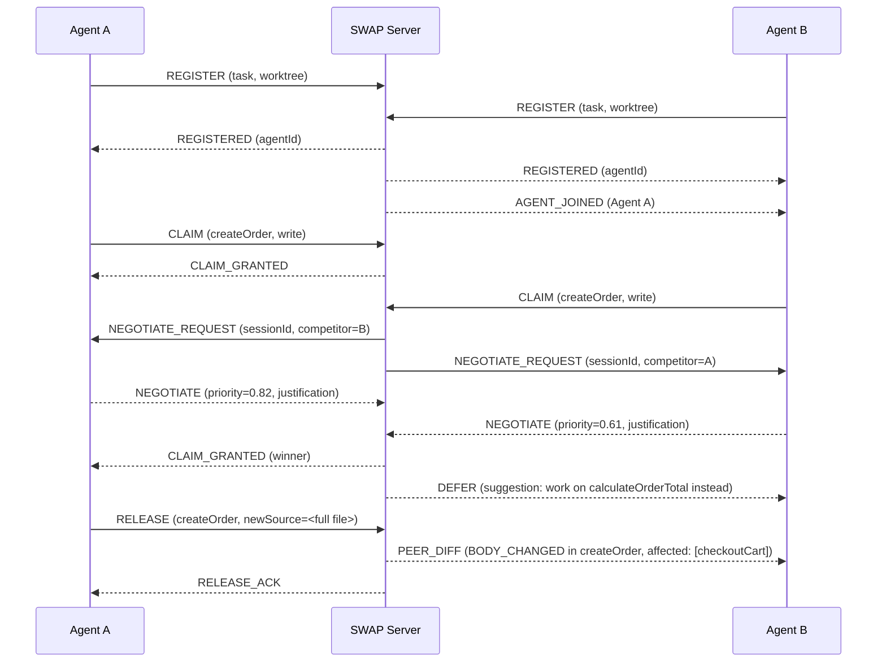
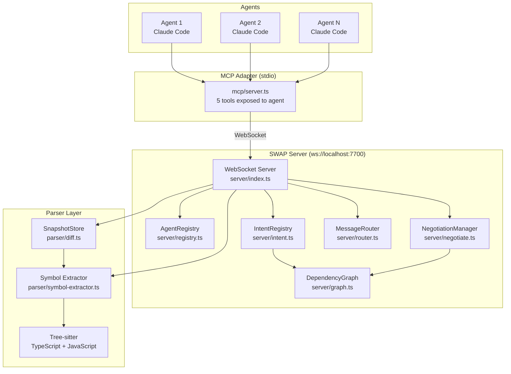
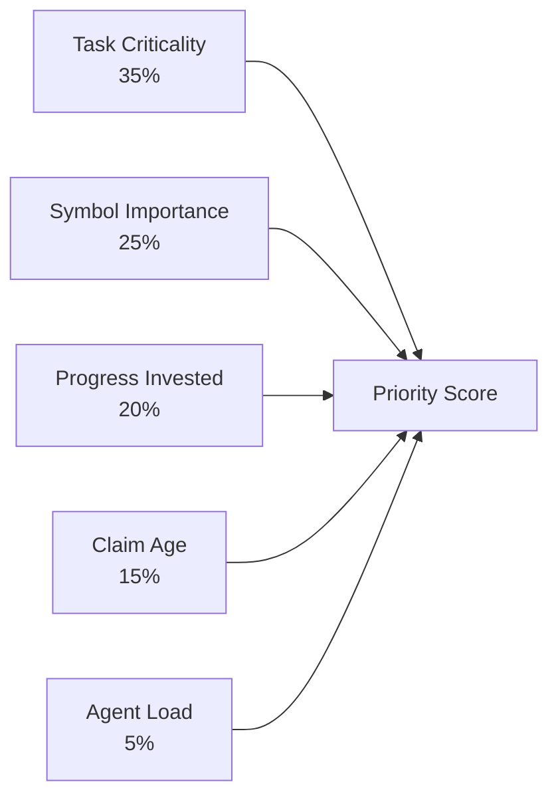
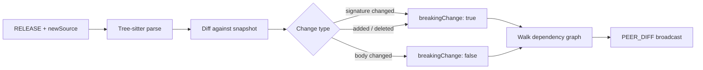

<div align="center">

# SWAP

### Semantic Workspace Awareness Protocol

**Real-time coordination infrastructure for parallel AI coding agents**


</div>

---

## Overview

SWAP is a coordination server that lets multiple Claude Code agents work on the same codebase simultaneously without producing merge conflicts. Each agent connects to a central WebSocket server, claims exclusive or shared ownership of individual functions and classes before editing them, and receives real-time semantic diffs when peers change symbols they depend on.

The result is that ten agents can rewrite ten different sections of a single TypeScript file at the same time, and the file is coherent when they finish.

---

## The Problem

When multiple AI agents edit code in parallel, they collide. Agent A rewrites `createOrder`. Agent B also needs `createOrder` as a dependency and starts editing it. Both changes land and the file is broken — or worse, one silently overwrites the other. The only existing solutions are sequential execution (slow) or post-hoc merge tooling (brittle).

SWAP solves this at the protocol level, before any edit happens.

---

## How It Works



---

## Architecture



---

## Components

### Server

| Module | Responsibility |
|---|---|
| `server/index.ts` | WebSocket server, message dispatch, heartbeat and TTL watchdogs |
| `server/registry.ts` | Live agent records — connection, status, claims, recent diffs |
| `server/intent.ts` | Symbol claim registry with read/write compatibility matrix |
| `server/negotiate.ts` | Priority scoring and negotiation session management |
| `server/graph.ts` | BFS dependency graph with transitive dependent counting |
| `server/router.ts` | Point-to-point and broadcast message delivery |

### Parser

| Module | Responsibility |
|---|---|
| `parser/symbol-extractor.ts` | Tree-sitter CST queries to extract symbols and dependency edges |
| `parser/diff.ts` | AST snapshot diffing — classifies changes as ADDED, DELETED, SIGNATURE_CHANGED, BODY_CHANGED |
| `parser/tree-sitter.ts` | Language detection and parser initialisation |
| `parser/languages/` | Per-language Tree-sitter queries (TypeScript, JavaScript) |

### MCP Adapter

| Module | Responsibility |
|---|---|
| `mcp/server.ts` | Stdio MCP server — bridges Claude's tool calls to WebSocket messages |
| `mcp/schema.ts` | Zod schemas for all five tool inputs |

### Shared

| Module | Responsibility |
|---|---|
| `shared/protocol.ts` | Message envelope encode/decode |
| `shared/types.ts` | Core type definitions — AgentRecord, SymbolClaim, SemanticDiff, etc. |
| `shared/constants.ts` | Tunable parameters — TTLs, timeouts, thresholds |

---

## Claim Compatibility Matrix

The IntentRegistry enforces a readers-writer lock model at the symbol level.

| Existing \ Incoming | `read` | `write` | `refactor` | `delete` |
|---|:---:|:---:|:---:|:---:|
| `read` | granted | conflict | conflict | conflict |
| `write` | conflict | conflict | conflict | conflict |
| `refactor` | conflict | conflict | conflict | conflict |
| `delete` | conflict | conflict | conflict | conflict |

Multiple agents may hold simultaneous read claims on the same symbol. Any write-type intent (`write`, `refactor`, `delete`) requires exclusive access and triggers negotiation if the symbol is already claimed.

---

## Priority Negotiation

When two agents conflict on a symbol, the server does not reject the second claim outright. It opens a negotiation session: both agents receive a `NEGOTIATE_REQUEST` and have 10 seconds to reply with a self-assessed priority score and justification. The server arbitrates using a weighted five-factor formula.



| Factor | Weight | Signal |
|---|---|---|
| Task Criticality | 35% | Keywords in task description — `auth`, `payment`, `security` score high; `cleanup`, `docs`, `style` score low |
| Symbol Importance | 25% | Number of transitive dependents in the dependency graph (BFS, depth cap 4) |
| Progress Invested | 20% | Number of diffs this agent has already released in the session |
| Claim Age | 15% | Age of the agent's oldest active claim, saturates at 10 minutes |
| Agent Load | 5% | Inverse of current claim count — lighter agents get a small boost |

If scores are within the tie threshold (`0.05`), the earlier claim time wins. If an agent does not respond within the timeout, it receives a 50% score penalty.

The losing agent receives a `DEFER` message with a concrete suggestion — unclaimed symbols in the same file it can work on instead.

---

## Semantic Diff Streaming

When an agent releases a symbol it passes the full updated file source. The server:

1. Parses the new source with Tree-sitter and extracts all symbols
2. Diffs against the stored snapshot — classifies each changed symbol
3. Walks the dependency graph to find transitive dependents of each changed symbol
4. Broadcasts a `PEER_DIFF` message to all other agents



Change types:

| Type | Breaking | Description |
|---|---|---|
| `ADDED` | false | New symbol appeared |
| `DELETED` | true | Symbol removed |
| `SIGNATURE_CHANGED` | true | Parameter list or return type changed |
| `BODY_CHANGED` | false | Implementation changed, signature stable |
| `RENAMED` | true | Symbol was renamed |

---

## MCP Tools

Agents interact with SWAP through five MCP tools. Claude Code discovers these automatically when launched with the per-agent MCP config.

| Tool | Purpose |
|---|---|
| `list_agents` | See all connected agents, their tasks, and current claims |
| `broadcast_intent` | Announce what you are about to do and which files you will touch |
| `claim_symbol` | Acquire exclusive or shared access to a function or class before editing |
| `release_symbol` | Release a claim and push the updated file so peers receive a semantic diff |
| `get_peer_context` | Read buffered PEER_DIFF and PEER_INTENT events from other agents |

### Recommended Protocol (per agent turn)

```
1. list_agents           — who else is here, what are they claiming
2. broadcast_intent      — announce your plan and files
3. claim_symbol          — for each symbol you will touch
4. make your edits
5. release_symbol        — for each claimed symbol, pass newSource
6. get_peer_context      — check what peers changed while you worked
```

---

## Project Structure

```
swap/
├── server/
│   ├── index.ts          # WebSocket server entrypoint
│   ├── registry.ts       # Agent registry
│   ├── intent.ts         # Symbol claim registry
│   ├── negotiate.ts      # Priority scoring + negotiation sessions
│   ├── graph.ts          # Dependency graph (BFS)
│   └── router.ts         # Message routing
├── parser/
│   ├── symbol-extractor.ts   # Tree-sitter symbol + edge extraction
│   ├── diff.ts               # Snapshot diffing
│   ├── tree-sitter.ts        # Parser setup + language detection
│   └── languages/
│       ├── typescript.ts     # TS/TSX query strings
│       └── javascript.ts     # JS query strings
├── mcp/
│   ├── server.ts         # MCP stdio adapter
│   └── schema.ts         # Tool input schemas
├── shared/
│   ├── protocol.ts       # Message encode/decode
│   ├── types.ts          # Core type definitions
│   └── constants.ts      # Configuration constants
├── demo/
│   ├── fixture/src/
│   │   └── platform.ts   # 400-line e-commerce platform (10-agent demo target)
│   ├── agents/
│   │   └── agent1.md … agent10.md   # Per-agent task prompts
│   ├── run-10-agents.sh  # Spawn 10 parallel Claude agents
│   └── logs/             # Per-agent output logs (generated at runtime)
├── swap                  # CLI launcher (swap server / swap start <id>)
├── CLAUDE.md             # Auto-loaded by Claude Code — teaches agents the protocol
└── package.json
```

---

## Getting Started

### Prerequisites

- Node.js 22+
- `ts-node` and `typescript` (installed via `npm install`)
- Claude Code CLI (`claude`)

### Install

```bash
git clone <repo>
cd swap
npm install
```

### Run the 10-agent demo

```bash
# From the swap directory
bash demo/run-10-agents.sh
```

This starts the SWAP server on port 7700, then spawns 10 Claude agents simultaneously. Each agent owns a disjoint set of functions in `demo/fixture/src/platform.ts` and coordinates via SWAP to avoid conflicts. Logs stream to `demo/logs/agent-N.log`.

Watch a specific agent:

```bash
tail -f demo/logs/agent-3.log
```

### Interactive sessions (manual prompting)

Use the `swap` CLI to open interactive Claude Code sessions where you type prompts manually:

```bash
# Terminal 1 — start the coordination server
./swap server

# Terminal 2 — open Agent 1
./swap start 1

# Terminal 3 — open Agent 2
./swap start 2
```

Each session launches Claude with `--dangerously-skip-permissions` and the SWAP MCP pre-loaded. The `CLAUDE.md` file in the repo root is auto-discovered and teaches each agent the 6-step protocol without any prompt engineering on your part.

---

## Configuration

Constants are in `shared/constants.ts`:

| Constant | Default | Description |
|---|---|---|
| `SERVER_PORT` | `7700` | WebSocket server port |
| `HEARTBEAT_INTERVAL_MS` | `10 000` | How often the watchdog checks for stale agents |
| `HEARTBEAT_TIMEOUT_MS` | `30 000` | Time after last heartbeat before an agent is pruned |
| `CLAIM_TTL_MS` | `30 min` | Maximum time a claim can be held without release |
| `NEGOTIATION_TIMEOUT_MS` | `10 000` | How long agents have to respond in a negotiation |
| `PRIORITY_TIE_THRESHOLD` | `0.05` | Score difference below which tie-break by claim time applies |
| `DEPENDENCY_GRAPH_MAX_DEPTH` | `4` | Maximum BFS depth for transitive dependent counting |
| `MAX_EVENT_BUFFER` | `50` | Maximum peer events buffered per agent for `get_peer_context` |

---

## Message Protocol Reference

All messages share a common envelope:

```typescript
{ id: string; type: string; payload: object }
```

### Client → Server

| Type | Payload | Description |
|---|---|---|
| `REGISTER` | `{ worktreePath, taskDescription }` | First message after connecting |
| `PING` | `{}` | Heartbeat |
| `LIST_AGENTS` | `{}` | Request current agent list |
| `BROADCAST_INTENT` | `{ description, filePaths }` | Announce upcoming work |
| `CLAIM` | `{ filePath, symbolName, intent, estimatedMinutes }` | Request symbol ownership |
| `RELEASE` | `{ filePath, symbolName, newSource? }` | Release symbol, optionally push diff |
| `NEGOTIATE` | `{ sessionId, priority, justification }` | Respond to a negotiation request |
| `STATUS_UPDATE` | `{ status }` | Set agent status (`idle`, `working`, `reviewing`) |

### Server → Client

| Type | Payload | Description |
|---|---|---|
| `REGISTERED` | `{ agentId }` | Registration confirmed |
| `AGENT_LIST` | `{ agents[], totalActive }` | Response to LIST_AGENTS |
| `AGENT_JOINED` | `{ agentId, taskDescription, worktreePath }` | Peer connected |
| `AGENT_LEFT` | `{ agentId }` | Peer disconnected |
| `CLAIM_GRANTED` | `{ filePath, symbolName, claimId }` | Claim approved |
| `CLAIM_CONFLICT` | `{ filePath, symbolName, heldBy, heldByTask, intent }` | Fallback if negotiation unavailable |
| `NEGOTIATE_REQUEST` | `{ sessionId, filePath, symbolName, competitorId, timeoutMs }` | Negotiation prompt |
| `DEFER` | `{ filePath, symbolName, deferTo, suggestion }` | Negotiation lost — here is an alternative |
| `RELEASE_ACK` | `{ filePath, symbolName }` | Release confirmed |
| `PEER_DIFF` | `SemanticDiff` | Peer released a symbol with changes |
| `PEER_INTENT` | `{ agentId, description, filePaths }` | Peer broadcast intent |
| `CLAIMS_RELEASED` | `{ agentId, released[] }` | Peer disconnected, their claims freed |
| `PONG` | `{}` | Heartbeat reply |

---

## Design Decisions

**Why symbol-level granularity instead of file-level locks?**
File-level locks would force 10 agents working on a 400-line file to take turns. Symbol-level claims mean 10 agents can work concurrently as long as their functions do not overlap — which is exactly what structured task assignment achieves.

**Why WebSocket instead of a message queue?**
Negotiation requires round-trip latency under 10 seconds. A message queue introduces broker hops that make tight negotiation timeouts unreliable. Direct WebSocket connections give sub-millisecond local latency.

**Why MCP instead of a custom agent API?**
MCP is the native tool-call interface for Claude Code. Using it means agents do not need custom runner code — they pick up the tools automatically from the server config and reason about when to call them using the same mechanism they use for file editing or search.

**Why Tree-sitter for diffing?**
Line-based diffs cannot distinguish a signature change from a body change. An agent editing `function foo(a: string)` into `function foo(a: string, b: number)` is a breaking change that all callers must know about. Tree-sitter gives SWAP the structural awareness to make that distinction and broadcast it accurately.
